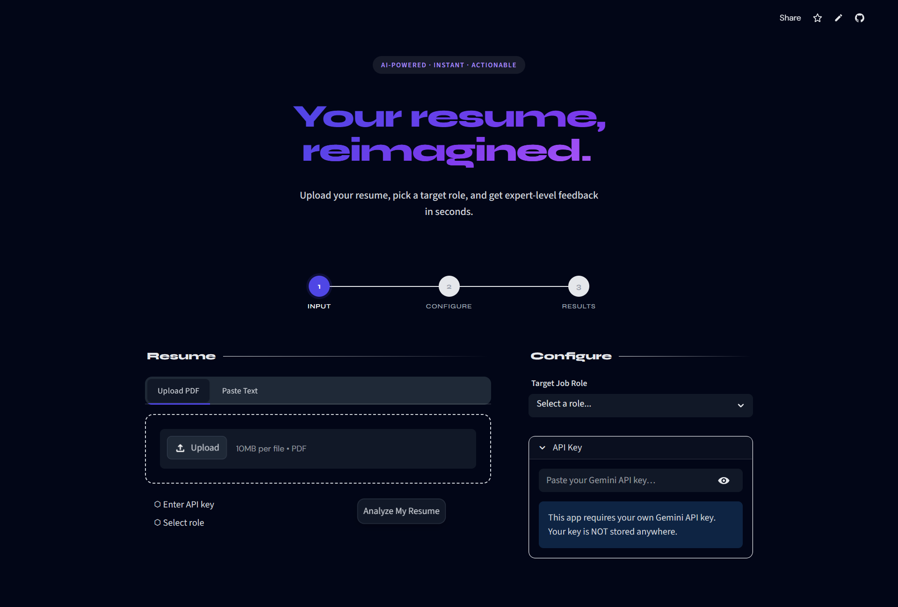

#  AI Resume Analyzer with Smart Feedback & Automation

An intelligent resume analysis tool built with **Python**, **Streamlit**, and **AI (Gemini/OpenAI)**.
Upload your resume, select a target role, and receive **instant, structured feedback** with scoring, improvements, and insights.

---

##  UI Preview



---

##  Features

*  Upload PDF or paste resume text
*  AI-powered resume scoring (0–100)
*  Section-wise feedback (Skills, Experience, Projects, etc.)
*  Missing skills detection for target role
*  Bullet point improvement suggestions
*  Auto-save analysis history (CSV)
*  Sidebar history viewer
*  Export analysis as PDF
*  Automation-ready (n8n / Zapier workflows)

---

##  Project Structure

```
ai_resume_analyzer/
│
├── app.py                   #  Main Streamlit app
│
├── utils/
│   ├── analyzer.py          #  AI analysis logic
│   ├── pdf_extractor.py     #  PDF text extraction
│   ├── storage.py           #  CSV storage + history
│   └── display.py           #  UI rendering functions
│
├── assets/
│   └── ui.png               #  UI preview image
│
├── data/
│   └── results.csv          #  Stored results
│
├── requirements.txt         #  Dependencies
├── .env.example             #  Environment variables template
└── README.md                #  Documentation
```

---

##  Quick Start

### 1. Clone the Repository

```bash
git clone https://github.com/your-username/ai-resume-analyzer.git
cd ai_resume_analyzer
```

---

### 2. Create Virtual Environment

```bash
python -m venv venv

# Activate
# Windows:
venv\Scripts\activate

# Mac/Linux:
source venv/bin/activate
```

---

### 3. Install Dependencies

```bash
pip install -r requirements.txt
```

---

### 4. Add API Key

Create `.env` file:

```bash
cp .env.example .env
```

Then add:

```
GEMINI_API_KEY=your_api_key_here
```

---

### 5. Run the App

```bash
streamlit run app.py
```

Open: http://localhost:8501

---

##  How It Works

1. Resume text is extracted from PDF or input
2. Sent to AI model for structured analysis 
3. JSON response is parsed and validated
4. UI renders:

   * Score
   * Feedback
   * Missing skills
   * Improved bullets 
5. Results stored locally in CSV 

---

##  Tech Stack

* **Python**
* **Streamlit**
* **Google Gemini API**
* **PyMuPDF / pdfplumber**
* **Pandas**

---

##  Automation Ideas

*  Auto-email resume feedback
*  Track improvement over time
*  Job match alerts

(See automation section in app UI)

---

##  Troubleshooting

| Issue            | Fix                    |
| ---------------- | ---------------------- |
| API key error    | Check key validity     |
| PDF not reading  | Try pasting text       |
| Module not found | Reinstall requirements |
| App not opening  | Try different port     |

---

##  Author

# Utsav Kumar
